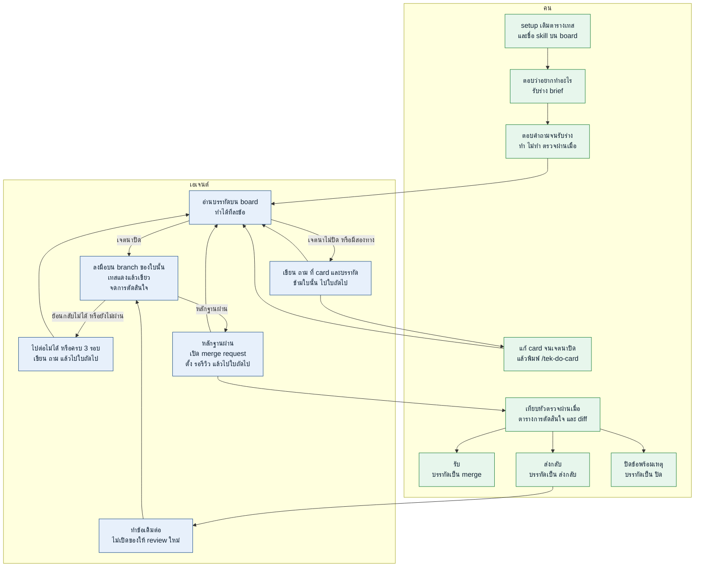

# tek-skill

ลูป backlog ของ repo ที่เปิดอยู่ คุณเขียน card แล้วเปลี่ยนคำบนบรรทัด เอเจนต์ทำเฉพาะข้อที่บรรทัดอนุญาต และไม่ไปทำ repo อื่น

ติดตั้งครั้งเดียวบนเครื่อง เลือกเจ้าที่คุณใช้

## ติดตั้ง

### Codex

```bash
npx skills add thitinan147/tek-skill -g -a codex -y
```

ในแชตพิมพ์ `$` แทน `/` เช่น `$tek-setup-board`

### Claude Code

```bash
npx skills add thitinan147/tek-skill -g -a claude-code -y
```

### Cursor

```bash
npx skills add thitinan147/tek-skill -g -a cursor -y
```

### Grok Build

```bash
npx skills add thitinan147/tek-skill -g -a grok -y
```

### Antigravity

```bash
npx skills add thitinan147/tek-skill -g -a antigravity -y
```

### Antigravity CLI

```bash
npx skills add thitinan147/tek-skill -g -a antigravity-cli -y
```

## ใช้ยังไง

เปิด git repo ที่จะทำ อยู่บน branch ที่จะเก็บคิว เช่น `main` และไม่มีไฟล์ค้างนอกโฟลเดอร์ `card-loop/` แล้วทำตามเลขนี้ Codex พิมพ์ `$` แทน `/`

1. พิมพ์ `/tek-setup-board` จะได้ `card-loop/board.md` ที่เติมตารางคำสั่งจาก repo นี้แล้ว และใส่ชื่อ skill จาก scan ลง `<TEK_SKILLS>` กับ `<REPO_SKILLS>` คุณไม่กรอกตารางเอง ช่องไหนไม่ตรงค่อยแก้ ถ้าไม่มีชุดเทส ช่อง `<TEST_CMD>` จะเป็น `ไม่มีชุดเทส`
2. พิมพ์ `/tek-brief` แล้วตอบว่าอยากทำอะไร ถามจนชัด รับร่างแล้วเอเจนต์เขียน `card-loop/brief.md` ยังไม่สร้าง card
3. พิมพ์ `/tek-add-card 12` เอเจนต์อ่าน brief แล้วถามต่อ งานที่แยกกันได้จะได้หลายร่างในครั้งเดียว รับเฉพาะใบที่ต้องการ เอเจนต์จึงสร้างไฟล์ card กับบรรทัดบน board ร่างใบเดียวที่รับแล้วหน้าตาแบบนี้ เปลี่ยน `my-app` เป็นชื่อ repo ของคุณ

```markdown
# 12 — ใส่ชื่อ repo ที่หัว board

ชนิด: docs

ทำ:
- เปลี่ยนบรรทัดแรกของ `card-loop/board.md` เป็น `# Board — my-app`

ไม่ทำ:
- ไม่แก้ตารางคำสั่ง
- ไม่เพิ่ม card อื่น

ตรวจผ่านเมื่อ:
- บรรทัดแรกของ board เป็น `# Board — my-app` ใน commit ของงาน
- commit นั้นไม่มีคำว่า `รอรีวิว:`

ทางที่เลือกแล้ว:
- ไม่มีสองทาง

ถาม:
```

4. พิมพ์ `/tek-do-card` เอเจนต์ทำทุกใบที่ลงมือได้ โค้ดของแต่ละใบอยู่บน branch `card-<เลข>` บรรทัดสถานะอยู่บนสาขาคิว ใบที่ขึ้น `รอรีวิว:` แล้วจะถูกข้าม ไม่มี remote จะขึ้น `รอรีวิว: local`
5. ถ้าใบใดเป็น `ถาม:` เอเจนต์ข้ามใบนั้น คุณแก้ card จนหัว **ถาม** ว่าง แล้วพิมพ์ `/tek-do-card` อีกครั้ง
6. เมื่อไรก็ได้ที่บรรทัดเป็น `รอรีวิว:` ให้พิมพ์ `/tek-open-review 12` แล้วเทียบหัวตรวจผ่านเมื่อ ตารางการตัดสินใจ และ diff ถ้ามีหลายใบที่ค้าง ให้ใส่รหัสใบนั้น ชื่อบนสาขาคิวเปลี่ยนเมื่อรับข้อแล้ว
7. เลือกอย่างใดอย่างหนึ่ง
   - รับ พิมพ์ `/tek-mark-merge 12` คำสั่งนี้ merge branch ของใบนั้นเข้าสาขาคิว รับด้วยคำสั่งนี้ใบเดียว
   - ส่งกลับ พิมพ์ `/tek-send-back 12` แล้วกลับไปข้อ 4
   - ไม่เอา พิมพ์ `/tek-mark-close 12 ไม่ทำแล้ว`

งานทั้งก้อนเดินแบบนี้ สถานะที่เชื่อมีแค่คำบนบรรทัดของ board



เรียกเมื่อต้องการ ไม่ใช่รอบแรก

| พิมพ์ | เกิดอะไร |
|---|---|
| `/tek-read-board` | บอกว่าข้อไหนค้าง |
| `/tek-scan-skills` | คำแนะนำ ไม่ใช่รายการที่ต้องลง ชื่อถูกใส่บน board ตอน setup แล้ว คุณติดตั้งเองเมื่อต้องการ |

## ไฟล์ที่อยู่ใน repo คุณ

commit โฟลเดอร์ `card-loop/`

- `brief.md` งานที่คุณอยากทำในรอบนี้
- `board.md` คิว คำสั่งเทส แถว `<TEK_SKILLS>` และ `<REPO_SKILLS>` คำบนบรรทัดคือสถานะ
- `backlog/12.md` ข้อตกลงที่คุณเขียน
- `plan/12.md` โน้ตของเอเจนต์ และตารางการตัดสินใจที่คุณอ่านตอน review
