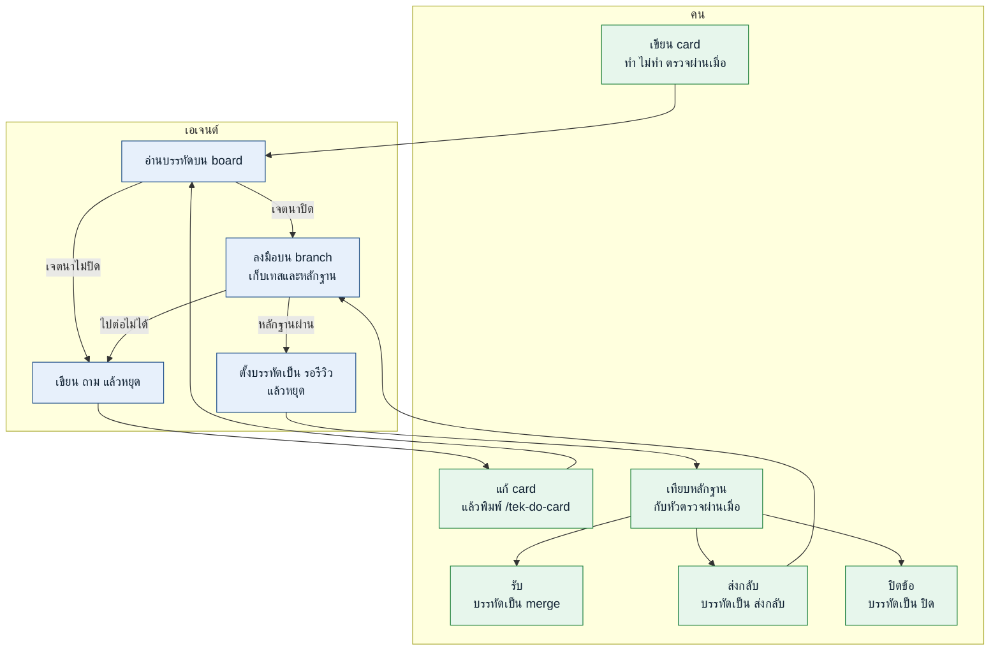

# tek-skill

ลูป backlog ของ repo ที่เปิดอยู่ คุณเขียน card แล้วเปลี่ยนคำบนบรรทัด เอเจนต์ทำเฉพาะข้อที่บรรทัดอนุญาต และไม่ไปทำ repo อื่น

ติดตั้งครั้งเดียวบนเครื่อง เลือกเจ้าที่คุณใช้

## ติดตั้ง

### Codex

```bash
npx skills add thitinan147/tek-skill -g -a codex -y
```

ในแชตพิมพ์ `$` แทน `/` เช่น `$tek-setup-board`

### Claude Code

```bash
npx skills add thitinan147/tek-skill -g -a claude-code -y
```

### Cursor

```bash
npx skills add thitinan147/tek-skill -g -a cursor -y
```

### Grok Build

```bash
npx skills add thitinan147/tek-skill -g -a grok -y
```

### Antigravity

```bash
npx skills add thitinan147/tek-skill -g -a antigravity -y
```

### Antigravity CLI

```bash
npx skills add thitinan147/tek-skill -g -a antigravity-cli -y
```

## ใช้ยังไง

เปิด repo ที่จะทำ งานเดินแบบนี้ สถานะที่เชื่อมีแค่คำบนบรรทัดของ board Codex ใช้ `$` แทน `/` ในตารางด้านล่าง



ข้อ 12 เป็นตัวอย่างของคำสั่งที่พิมพ์ในแต่ละขั้น

รอบแรกเว้น `<TEK_SKILLS>` กับ `<REPO_SKILLS>` ว่าง

| ขั้น | พิมพ์ | เกิดอะไร |
|---|---|---|
| เริ่ม repo นี้ | `/tek-setup-board` | ได้ `card-loop/board.md` คุณเติมตารางคำสั่งเทส |
| เพิ่มข้อ | `/tek-add-card 12` | ได้ `card-loop/backlog/12.md` คุณเขียนทำ ไม่ทำ และตรวจผ่านเมื่อ |
| ให้ทำให้ | `/tek-do-card` | เอเจนต์ทำข้อที่บรรทัดอนุญาต แล้วตั้ง `รอรีวิว:` หรือเขียน `ถาม:` |
| หลังเห็น `ถาม:` | แก้ card แล้ว `/tek-do-card` | หัว **ถาม** ว่างแล้วเอเจนต์ทำข้อนั้นต่อ |
| ดูของที่เปิดไว้ | `/tek-open-review` | เทียบหัวตรวจผ่านเมื่อ ตารางการตัดสินใจใน plan และ diff |
| รับ | `/tek-mark-merge` | ติ๊ก `merge:` |
| ส่งกลับ | `/tek-send-back` แล้ว `/tek-do-card` | บรรทัดเป็น `ส่งกลับ:` แล้วเอเจนต์ทำข้อเดิมต่อ |
| ไม่เอา | `/tek-mark-close ไม่ทำแล้ว` | ติ๊ก `ปิด:` พร้อมเหตุ |

card ที่เขียนจบแล้วหน้าตาแบบนี้ เอเจนต์ลงมือได้โดยไม่ต้องถามทาง

```markdown
# 12 — ใส่ชื่อ repo ที่หัว board

ชนิด: docs

ทำ:
- เปลี่ยน `<REPO_NAME>` ใน `card-loop/board.md` เป็นชื่อ repo จริง

ไม่ทำ:
- ไม่แก้ตารางคำสั่ง
- ไม่เพิ่ม card อื่น

ตรวจผ่านเมื่อ:
- หัวไฟล์ board เป็นชื่อ repo จริง
- diff มีแค่บรรทัดหัวนั้น
```

เรียกเมื่อต้องการ ไม่ใช่รอบแรก

| พิมพ์ | เกิดอะไร |
|---|---|
| `/tek-read-board` | บอกว่าข้อไหนค้าง |
| `/tek-scan-skills` | คำแนะนำ ไม่ใช่รายการที่ต้องลง เห็นจำนวนคนติดตั้งถึงจะแนะนำ คุณติดตั้งเอง ชื่อที่ช่วยลงมือใส่ `<TEK_SKILLS>` ชื่อของ repo ใส่ `<REPO_SKILLS>` |

## ไฟล์ที่อยู่ใน repo คุณ

commit โฟลเดอร์ `card-loop/`

- `board.md` คิว คำสั่งเทส แถว `<TEK_SKILLS>` และ `<REPO_SKILLS>` คำบนบรรทัดคือสถานะ
- `backlog/12.md` ข้อตกลงที่คุณเขียน
- `plan/12.md` โน้ตของเอเจนต์ และตารางการตัดสินใจที่คุณอ่านตอน review
