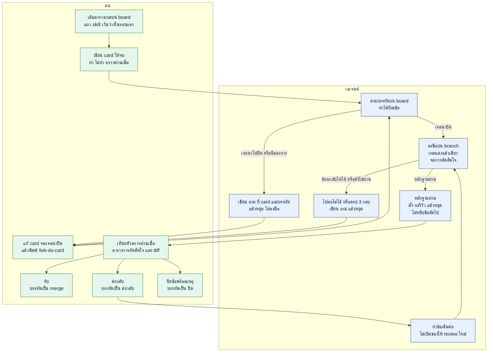

# tek-skill

ลูป backlog ของ repo ที่เปิดอยู่ คุณเขียน card แล้วเปลี่ยนคำบนบรรทัด เอเจนต์ทำเฉพาะข้อที่บรรทัดอนุญาต และไม่ไปทำ repo อื่น

ติดตั้งครั้งเดียวบนเครื่อง เลือกเจ้าที่คุณใช้

## ติดตั้ง

### Codex

```bash
npx skills add thitinan147/tek-skill -g -a codex -y
```

ในแชตพิมพ์ `$` แทน `/` เช่น `$tek-setup-board`

### Claude Code

```bash
npx skills add thitinan147/tek-skill -g -a claude-code -y
```

### Cursor

```bash
npx skills add thitinan147/tek-skill -g -a cursor -y
```

### Grok Build

```bash
npx skills add thitinan147/tek-skill -g -a grok -y
```

### Antigravity

```bash
npx skills add thitinan147/tek-skill -g -a antigravity -y
```

### Antigravity CLI

```bash
npx skills add thitinan147/tek-skill -g -a antigravity-cli -y
```

## ใช้ยังไง

เปิด repo ที่จะทำ แล้วทำตามเลขนี้ Codex พิมพ์ `$` แทน `/` รอบแรกเว้น `<TEK_SKILLS>` กับ `<REPO_SKILLS>` ว่าง

1. พิมพ์ `/tek-setup-board` จะได้ `card-loop/board.md` เปิดไฟล์นั้นแล้วเติมตารางคำสั่งเทส
2. พิมพ์ `/tek-add-card 12` จะได้ `card-loop/backlog/12.md` เขียนสามหัวนี้ให้จบ

```markdown
# 12 — ใส่ชื่อ repo ที่หัว board

ชนิด: docs

ทำ:
- เปลี่ยน `<REPO_NAME>` ใน `card-loop/board.md` เป็นชื่อ repo จริง

ไม่ทำ:
- ไม่แก้ตารางคำสั่ง
- ไม่เพิ่ม card อื่น

ตรวจผ่านเมื่อ:
- หัวไฟล์ board เป็นชื่อ repo จริง
- commit ของงานแก้แค่บรรทัดหัว ไม่นับ commit ที่ตั้ง `รอรีวิว:`
```

3. พิมพ์ `/tek-do-card` เอเจนต์ทำให้ข้อ 12 แล้วหยุด
4. ถ้าบรรทัดเป็น `ถาม:` ให้แก้ card จนหัว **ถาม** ว่าง แล้วพิมพ์ `/tek-do-card` อีกครั้ง
5. ถ้าบรรทัดเป็น `รอรีวิว:` ให้พิมพ์ `/tek-open-review` แล้วเทียบหัวตรวจผ่านเมื่อ ตารางการตัดสินใจ และ diff
6. เลือกอย่างใดอย่างหนึ่ง
   - รับ พิมพ์ `/tek-mark-merge`
   - ส่งกลับ พิมพ์ `/tek-send-back` แล้วกลับไปข้อ 3
   - ไม่เอา พิมพ์ `/tek-mark-close ไม่ทำแล้ว`

งานทั้งก้อนเดินแบบนี้ สถานะที่เชื่อมีแค่คำบนบรรทัดของ board



เรียกเมื่อต้องการ ไม่ใช่รอบแรก

| พิมพ์ | เกิดอะไร |
|---|---|
| `/tek-read-board` | บอกว่าข้อไหนค้าง |
| `/tek-scan-skills` | คำแนะนำ ไม่ใช่รายการที่ต้องลง เห็นจำนวนคนติดตั้งถึงจะแนะนำ คุณติดตั้งเอง ชื่อที่ช่วยลงมือใส่ `<TEK_SKILLS>` ชื่อของ repo ใส่ `<REPO_SKILLS>` |

## ไฟล์ที่อยู่ใน repo คุณ

commit โฟลเดอร์ `card-loop/`

- `board.md` คิว คำสั่งเทส แถว `<TEK_SKILLS>` และ `<REPO_SKILLS>` คำบนบรรทัดคือสถานะ
- `backlog/12.md` ข้อตกลงที่คุณเขียน
- `plan/12.md` โน้ตของเอเจนต์ และตารางการตัดสินใจที่คุณอ่านตอน review
